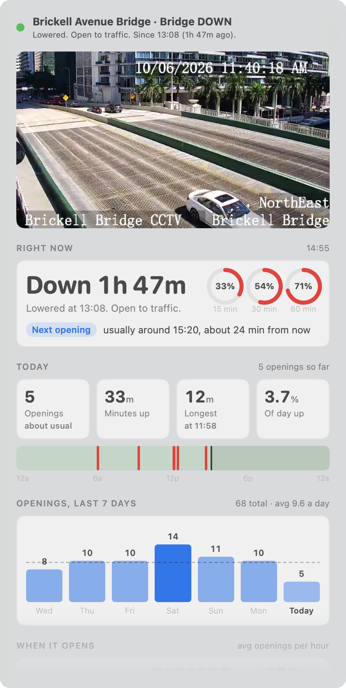
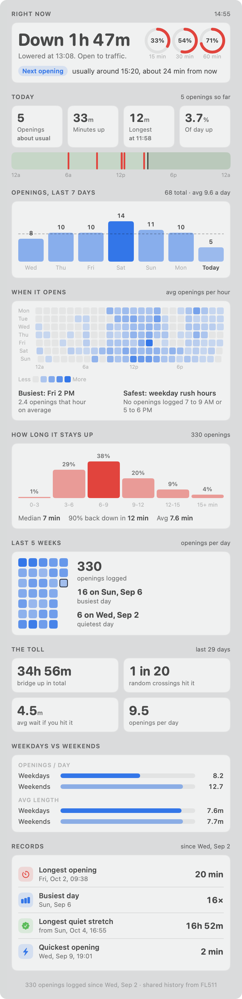

<div align="center">


# Brickell Bridge

**Know if the Brickell Avenue Bridge is up before you get there.**

A tiny macOS menu bar app that shows the live status of Miami's Brickell Avenue drawbridge, with the live traffic cam and opening stats one click away.

[](https://github.com/antondkg/brickell-bridge/actions/workflows/build.yml)
[](https://github.com/antondkg/brickell-bridge/releases/latest)
[](#install)
[](main.swift)
[](#how-it-works)
[](#the-stats-api)
[](LICENSE)

<picture>
  <source media="(prefers-color-scheme: dark)" srcset="assets/screenshot-dark.png">
  
</picture>

</div>

## Website

**[brickellbridge.fun](https://brickellbridge.fun)** answers the question in one viewport: a live 3D Brickell with the bridge raising and lowering with the real status. By default it streams Google's photorealistic 3D city, with our animated bascule span cut into it. If that's unavailable (no key, or the daily cap is reached), it falls back to a model built entirely from stored open data: OpenStreetMap buildings and Miami-Dade County's 2025 aerial photos. You can drag around, scrub the time of day, or hit **Watch it open**. Add `?t=19.5` to pin a time, or `?map=model` to see the open-data model.

## Why

If you live or work around Brickell, you know the bridge goes up at the worst possible time. FL511 sends email alerts, but they're easy to miss and they don't tell you how long it's been up. This puts the answer in your menu bar.

## Features

- **Live status in the menu bar.** Checks FL511 every 15 seconds.
- **Animated icon.** The bridge leaves raise and lower when the status changes, and the icon turns red while the bridge is up.
- **Live camera.** Click the icon to watch the Brickell Bridge CCTV stream right in the popover.
- **"Since" timer.** See when the bridge last changed and how long ago.
- **Forecast.** Knows the federal opening schedule (half-hourly on weekdays, no openings at rush hour) and warns when a tug, freighter or tall boat is heading for the bridge, using live AIS ship tracking.
- **Stats.** Chance it opens in the next 15, 30 or 60 minutes, when the next opening usually happens, today's timeline, a weekly chart, an hour-by-day heatmap, how long openings last, a 5-week calendar, and records.
- **Shared history.** A small server logs every opening around the clock, so everyone sees the same stats, even when their Mac was asleep.
- **Notifications.** Get a macOS notification when the bridge goes up or comes down.
- **Launch at login.** One checkbox.
- **Tiny.** Two Swift files, no dependencies, no accounts, no email setup.

## Stats

<details>
<summary><b>See every stat</b> (sample data)</summary>
<br>
<div align="center">
<picture>
  <source media="(prefers-color-scheme: dark)" srcset="assets/stats-dark.png">
  
</picture>
</div>
</details>

| Section | What it tells you |
| --- | --- |
| Right now | How long it's been down or up, the chance it opens in the next 15/30/60 min, and when the next opening (or closing) usually happens. |
| Today | Openings so far vs a typical day, minutes up, longest opening, share of the day up, and a 24-hour timeline. |
| Last 7 days | Openings per day against the long-run average. |
| When it opens | Average openings for every hour of every weekday. |
| How long it stays up | Distribution of opening lengths, with median and 90th percentile. |
| Last 5 weeks | Calendar heatmap with busiest and quietest days. |
| The toll | Total time up, the odds a random crossing hits it, and the average wait if it does. |
| Weekdays vs weekends | Openings per day and average length, side by side. |
| Records | Longest opening, busiest day, longest quiet stretch, quickest opening. |

History starts the day the server first ran, so patterns need a couple of weeks to settle.

## Menu bar states

<table>
  <tr>
    <td align="center">
      <picture><source media="(prefers-color-scheme: dark)" srcset="assets/icon-down-dark.png"></picture>
      <br><b>Down</b><br><sub>Open to traffic</sub>
    </td>
    <td align="center">
      <picture><source media="(prefers-color-scheme: dark)" srcset="assets/icon-mid-dark.png"></picture>
      <br><b>Raising</b><br><sub>Animates on change</sub>
    </td>
    <td align="center">
      <picture><source media="(prefers-color-scheme: dark)" srcset="assets/icon-up-dark.png"></picture>
      <br><b>Up</b><br><sub>Closed to traffic</sub>
    </td>
  </tr>
</table>

When the bridge is down, the icon is a template image, so it follows your menu bar's light or dark appearance. If FL511 can't be reached, a `?` appears over the deck.

## Install

### Download

1. Grab `BrickellBridge.zip` from the [latest release](https://github.com/antondkg/brickell-bridge/releases/latest).
2. Unzip it and move **BrickellBridge.app** to `/Applications`.
3. The app is ad-hoc signed, not notarized, so macOS will block it the first time. Clear the quarantine flag once:

   ```bash
   xattr -dr com.apple.quarantine /Applications/BrickellBridge.app
   ```

4. Open it. The bridge icon shows up in your menu bar.

### Build from source

You need Xcode or the Xcode Command Line Tools.

```bash
git clone https://github.com/antondkg/brickell-bridge.git
cd brickell-bridge
INSTALL=1 ./build.sh
```

`./build.sh` alone builds `BrickellBridge.app` in the repo folder. With `INSTALL=1`, it also copies the app to `/Applications` and launches it.

## How it works

Everything comes from [FL511](https://fl511.com), Florida's official traveler information service. The app talks to `fl511.com`, FL511's video host `divas.cloud`, and the stats API below.

| What | Source |
| --- | --- |
| Bridge status | `GET fl511.com/List/GetData/Bridge`, the same public list that powers FL511's drawbridge page. Brickell Avenue Bridge is item `253`. |
| Live video | `GET fl511.com/Camera/GetVideoUrl?imageId=5359` returns a token request, which `divas.cloud/VDS-API/SecureTokenUri/GetSecureTokenUriBySourceId` turns into a short-lived `?token=` for the HLS stream. Stream requests need a `Referer: https://fl511.com/` header. |
| Snapshot fallback | `GET fl511.com/map/Cctv/5359`, shown while the stream warms up if FL511 has a real snapshot. Its "No live camera feed" placeholder is ignored. |
| Opening history | `GET api.brickellbridge.fun/v1/openings?days=35`, from the stats API. |

A few notes:

- FL511 starts a fresh transcode for each viewer, so the stream takes about 10 to 15 seconds to start. The app keeps a small buffer and resumes on its own if playback catches up to the live edge.
- The stream only runs while the popover is open. Closing it stops all video traffic.
- Status polling is one small JSON request every 15 seconds. History refreshes every 5 minutes and right after a change.
- If the video server is down, the popover says so and retries every 30 seconds.

## The stats API

FL511 only reports the current status, so history needs something that's always watching. [`api/`](api) is a Cloudflare Worker with a SQLite-backed Durable Object:

- A Durable Object alarm polls FL511 every 15 seconds and writes one row per opening.
- A cron trigger every 5 minutes re-arms the alarm if it ever stops.
- It runs comfortably inside Cloudflare's free plan.

| Endpoint | Returns |
| --- | --- |
| [`/v1/status`](https://api.brickellbridge.fun/v1/status) | Current state, when it last changed, and when the server last checked. |
| [`/v1/openings?days=35`](https://api.brickellbridge.fun/v1/openings?days=35) | Every opening in the window (`start`, `end`, ISO 8601, `end` is null while up), plus `trackingSince`. Up to 120 days. |
| [`/v1/forecast`](https://api.brickellbridge.fun/v1/forecast) | Where the federal opening schedule stands now (`on-signal`, `half-hourly` or `closed-to-boats`), until when, and the next times the bridge may open. Add `?at=` with an ISO time to check any moment. |

### The opening schedule

The Brickell Avenue Bridge runs on a federal schedule, [33 CFR 117.305(d)](https://www.law.cornell.edu/cfr/text/33/117.305). It opens whenever a boat signals, except on weekdays (not federal holidays): from 7 AM to 7 PM it only has to open on the hour and half hour, and from 7:35 to 8:59 AM, 12:05 to 12:59 PM and 4:35 to 5:59 PM it doesn't have to open at all. Tugs, government vessels and emergencies are exempt.

The app does all the math itself from the raw openings, so the API stays tiny. It's open to anyone, with CORS enabled.

### Run your own

```bash
cd api
npx wrangler login
npx wrangler deploy
```

First swap the `routes` entry in [`api/wrangler.jsonc`](api/wrangler.jsonc) for your own domain, or replace it with `"workers_dev": true` to use a free `workers.dev` address. Then point the app at it with `BB_API=https://your-api.example.com`, or change `StatsAPI.base` in [`main.swift`](main.swift). Set `BRIDGE_ID` in [`api/wrangler.jsonc`](api/wrangler.jsonc) to track a different bridge.

To work on the stats UI without waiting for history, launch with sample data:

```bash
BB_DEMO=1 ./BrickellBridge.app/Contents/MacOS/BrickellBridge
```

## Use it for a different bridge

FL511 tracks about 20 drawbridges. To point the app at another one, change the IDs at the top of [`main.swift`](main.swift) and deploy your own API with the same `BRIDGE_ID`:

```swift
static let bridgeId = "253"        // drawbridge item ID
static let cameraImageId = "5359"  // CCTV image ID
static let streamBase = "https://dis-se1.divas.cloud:8200/chan-12074_h/index.m3u8"
```

Find the bridge ID by searching the drawbridge list:

```bash
curl -s 'https://fl511.com/List/GetData/Bridge?query=%7B%22columns%22%3A%5B%7B%22data%22%3Anull%2C%22name%22%3A%22%22%7D%5D%2C%22start%22%3A0%2C%22length%22%3A100%2C%22search%22%3A%7B%22value%22%3A%22%22%7D%7D' \
  | python3 -c 'import json,sys; [print(r["DT_RowId"], r["status"], r["name"]) for r in json.load(sys.stdin)["data"]]'
```

To find a camera, search the camera list for the bridge name. Use the image `id` and `videoUrl`:

```bash
curl -s 'https://fl511.com/List/GetData/Cameras?query=%7B%22columns%22%3A%5B%7B%22data%22%3Anull%2C%22name%22%3A%22%22%7D%5D%2C%22start%22%3A0%2C%22length%22%3A10%2C%22search%22%3A%7B%22value%22%3A%22brickell%22%7D%7D' \
  | python3 -m json.tool | grep -E '"id"|videoUrl|description'
```

## Data sources

| Data | Source | License |
| --- | --- | --- |
| Bridge status | [FL511](https://fl511.com) | Public, unofficial use |
| Buildings, streets, water | [OpenStreetMap](https://www.openstreetmap.org/copyright) via `api/scripts/build_city.py` | ODbL |
| Aerial photos | Miami-Dade County 2025 aerial imagery via `api/scripts/build_imagery.py` | Florida public record, credited on the page |
| Opening rules | 33 CFR 117.305 | Public domain |

Photoreal mode streams Google's photorealistic 3D tiles live, per Google's terms. Nothing from Google is stored, and the key lives in a worker secret (`GOOGLE_TILES_KEY`), not in the repo.

## Privacy

No accounts, analytics or tracking, and no email access. The app makes anonymous requests to FL511's public endpoints and to the stats API, which stores bridge openings and nothing about you.

## Disclaimer

This is an unofficial hobby project. It is not affiliated with or endorsed by FL511, the Florida Department of Transportation or the City of Miami. Status data comes from FL511 and may lag the real world. Don't use it while driving.

## License

[MIT](LICENSE) © Antonio Goncalves
